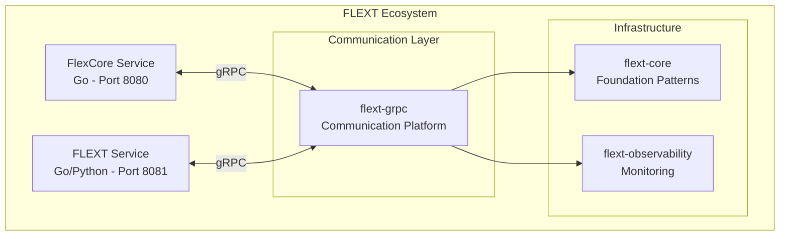

# FLEXT gRPC - Enterprise gRPC Communication Platform

[](https://www.python.org/downloads/)
[](https://grpc.io/)
[](https://blog.cleancoder.com/uncle-bob/2012/08/13/the-clean-architecture.html)
[](https://pytest.org)
[](docs/TODO.md)

**gRPC communication infrastructure for the FLEXT ecosystem**. Provides high-performance, type-safe communication between microservices with Clean Architecture patterns and Domain-Driven Design principles.

> **⚠️ Development Status**: Currently under active development. Core functionality implemented but [critical gaps identified](docs/TODO.md). **Not production-ready**.

## Overview

FLEXT gRPC serves as the **communication backbone** for the FLEXT distributed data integration platform, enabling:

- **Service-to-Service Communication** between FlexCore (Go) and FLEXT Service (Python)
- **Cross-Language Type Safety** with shared Protocol Buffers
- **Enterprise-Grade Features** including streaming, error handling, and monitoring
- **Clean Architecture Integration** with flext-core foundational patterns

### Position in FLEXT Ecosystem



## Current Status & Roadmap

### ✅ **Completed Features**

- **Domain Entities**: Server, Client, Channel, Service, Stream entities with state management
- **Service Layer**: Business logic services following DDD patterns
- **Platform API**: Unified facade for gRPC operations
- **Configuration Management**: Type-safe configuration with Pydantic
- **Error Handling**: FlextResult pattern integration
- **Testing Infrastructure**: Unit, integration, and E2E test structure

### 🚧 **In Development**

- **Protocol Buffer Implementation**: Shared .proto definitions for Go/Python interoperability
- **Service Discovery Integration**: Dynamic service registration and discovery
- **Cross-Language Testing**: Automated Go/Python integration testing

### ⏳ **Planned Features**

- **Performance Benchmarking**: Latency and throughput testing
- **Advanced Streaming**: Bidirectional streaming with backpressure
- **Security Features**: TLS/mTLS authentication and authorization
- **Monitoring Integration**: Comprehensive observability with flext-observability

See [docs/TODO.md](docs/TODO.md) for detailed gap analysis and development priorities.

## Quick Start

### Installation

```bash
# Install via Poetry (development)
cd /path/to/flext-workspace
poetry add ./flext-grpc

# Or from PyPI (when released)
pip install flext-grpc
```

### Basic Usage

```python
from flext_grpc import FlextGrpcPlatform, FlextGrpcServer
from flext_core import FlextResult
from datetime import datetime, timezone

# Create gRPC server entity
server = FlextGrpcServer(
    id="main-server",
    host="localhost",
    port=50051,
    max_workers=10,
    created_at=datetime.now(timezone.utc)
)

# Validate configuration
validation_result = server.validate_domain_rules()
if validation_result.is_failure:
    print(f"Invalid configuration: {validation_result.error}")
    exit(1)

# Initialize platform
platform = FlextGrpcPlatform()

# Server operations through platform
server_result = platform.service.execute("create_server", server)
if server_result.is_success:
    print(f"Server created: {server_result.data.state}")
```

For complete examples, see [examples/](examples/) directory.

## Architecture

### Clean Architecture + DDD Structure

```
src/flext_grpc/
├── entities.py           # Domain entities (Server, Client, Channel, Service, Stream)
├── services.py           # Domain services (business logic)
├── platform.py           # Application service (unified facade)
├── config.py             # Configuration management
├── types.py              # Type definitions and validation
├── errors.py             # Domain-specific errors
├── constants.py          # Domain constants
└── api.py                # Public API functions
```

### Key Architectural Patterns

- **Entity Pattern**: Immutable domain entities with `copy_with()` methods
- **Service Pattern**: Domain services for business operations
- **Result Pattern**: `FlextResult` for error handling without exceptions
- **Dependency Injection**: Global container integration via flext-core
- **State Machines**: Clear state transitions for all gRPC entities

### Domain Entities

#### FlextGrpcServer

Server lifecycle management with states: `stopped` → `starting` → `running` → `stopping`

#### FlextGrpcClient

Client connection management with host, port, and SSL configuration

#### FlextGrpcChannel

gRPC channel abstraction with connection state tracking

#### FlextGrpcService

Service definition with method registration and metadata

#### FlextGrpcStream

Streaming operations support (unary, server streaming, client streaming, bidirectional)

## Development

### Development Setup

```bash
# Complete development environment
make setup                    # Install dependencies + pre-commit hooks

# Quality gates (must pass before commits)
make validate                 # Complete validation pipeline
make check                    # Quick health check
make test                     # Run tests with coverage
```

### Quality Standards

- **Test Coverage**: Minimum 90% (currently 86% - [improvement needed](docs/TODO.md))
- **Type Safety**: Strict MyPy validation (currently failing - [fixes needed](docs/TODO.md))
- **Code Quality**: Ruff linting with ALL rules enabled
- **Security**: Bandit + pip-audit scanning

### Testing

```bash
# Test categories
make test-unit                # Unit tests (isolated components)
make test-integration         # Integration tests (component interaction)
make test-grpc                # gRPC-specific functionality
make test-fast                # Quick feedback without coverage

# Coverage analysis
make coverage-html            # Generate HTML coverage report
```

## FLEXT Ecosystem Integration

### FlexCore Integration

FLEXT gRPC provides communication layer between:

- **FlexCore (Go)**: Runtime container service (port 8080)
- **FLEXT Service (Go/Python)**: Data processing service (port 8081)

```python
# Integration with FlexCore service
from flext_grpc import FlextGrpcClient

# Create client for FlexCore
flexcore_client = FlextGrpcClient(
    id="flexcore-client",
    host="localhost",
    port=8080,
    created_at=datetime.now(timezone.utc)
)

# Connect and execute operations
# (Full implementation pending Protocol Buffer definitions)
```

### flext-core Foundation

Built on flext-core patterns:

- **FlextResult**: Robust error handling without exceptions
- **FlextEntity**: Base entity with validation and comparison
- **Dependency Injection**: Global container for service management
- **Domain Services**: Business logic abstraction

### flext-observability Integration

Monitoring and observability features:

- **Performance Metrics**: gRPC call latency and throughput
- **Health Checks**: Server and client connectivity monitoring
- **Error Tracking**: Comprehensive error monitoring and alerting
- **Distributed Tracing**: Request tracking across service boundaries

## Configuration

### Environment Variables

```bash
# gRPC server settings
export FLEXT_GRPC_HOST=localhost
export FLEXT_GRPC_PORT=50051
export FLEXT_GRPC_MAX_WORKERS=10
export FLEXT_GRPC_TIMEOUT=30.0

# Development settings
export FLEXT_GRPC_DEV_MODE=true
export FLEXT_LOG_LEVEL=debug

# Protocol Buffers
export PROTOBUF_PYTHON_IMPLEMENTATION=python
```

### Configuration Class

```python
from flext_grpc import FlextGrpcConfig

config = FlextGrpcConfig(
    host="0.0.0.0",
    port=50051,
    max_workers=10,
    timeout=30.0,
    dev_mode=True
)

# Configuration is automatically validated using Pydantic
platform = FlextGrpcPlatform(config.model_dump())
```

## Troubleshooting

### Common Issues

```bash
# Development diagnostics
make doctor                   # Complete health check
make diagnose                 # Show environment information

# Type checking issues
make type-check               # Run MyPy validation
# Fix known issues: see docs/TODO.md

# Test coverage issues
make coverage-html            # Identify untested code
# Target: increase from 86% to 90%+

# Clean environment issues
make reset                    # Complete environment reset
```

### Debug Mode

```bash
# Enable comprehensive debugging
export FLEXT_LOG_LEVEL=debug
export GRPC_VERBOSITY=debug
export GRPC_TRACE=all

# Run with debugging
poetry run python examples/basic_usage.py
```

## Documentation

- **[Development Guide](CLAUDE.md)** - Complete development guidance
- **[TODO & Issues](docs/TODO.md)** - Current gaps and development priorities
- **[Architecture](docs/architecture/)** - Detailed architectural documentation
- **[Examples](examples/)** - Practical usage examples
- **[API Reference](docs/api/)** - Complete API documentation

## Contributing

1. **Follow FLEXT Standards**: Use patterns from flext-core and Clean Architecture
2. **Maintain Quality**: All quality gates must pass (`make validate`)
3. **Write Tests**: Minimum 90% coverage for new features
4. **Document Changes**: Update relevant documentation
5. **Use FlextResult**: Consistent error handling patterns

Before contributing, review:

- [CLAUDE.md](CLAUDE.md) for development patterns
- [docs/TODO.md](docs/TODO.md) for current priorities
- [docs/architecture/](docs/architecture/) for design principles

## License

MIT License - Part of the FLEXT ecosystem.

## Status Summary

**Development Phase**: Active development with core patterns implemented  
**Production Readiness**: Not ready - critical gaps in Protocol Buffers and type safety  
**Next Milestone**: Protocol Buffer implementation and Go integration  
**Timeline**: 2-3 weeks for production readiness

For detailed development status, see [docs/TODO.md](docs/TODO.md).
