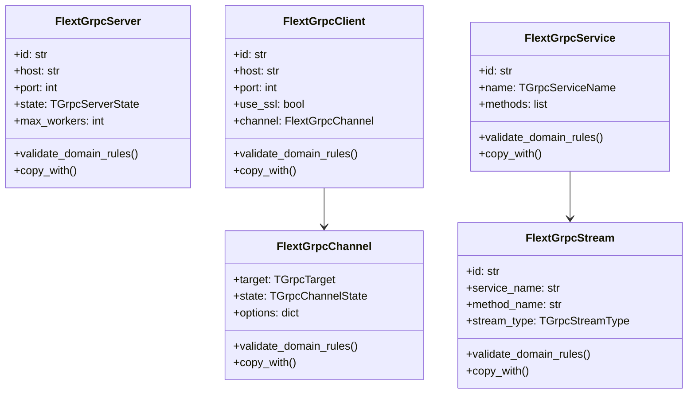
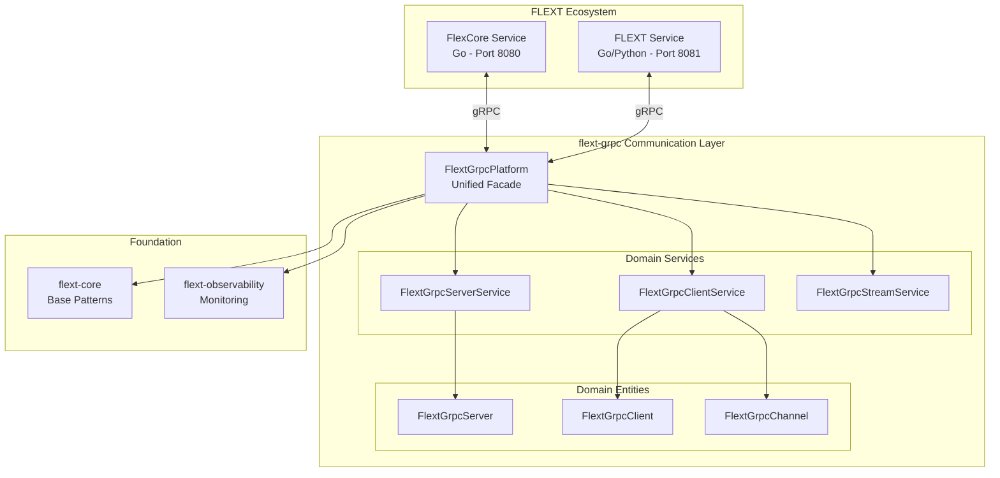

# FLEXT gRPC Architecture

Enterprise-grade gRPC communication platform built with Clean Architecture and Domain-Driven Design principles.

## Overview

FLEXT gRPC implements a layered architecture that provides clear separation of concerns and maintainable code organization for enterprise gRPC communication.

### Architectural Principles

- **Clean Architecture**: Clear dependency direction from external layers to domain core
- **Domain-Driven Design**: Rich domain model with business logic encapsulation
- **CQRS Patterns**: Command and query responsibility separation
- **Result Pattern**: Railway-oriented programming for error handling
- **Dependency Injection**: Inversion of control for testability and flexibility

## Layer Structure

### Domain Layer (Core)

**Location**: `src/flext_grpc/entities.py`, `src/flext_grpc/types.py`, `src/flext_grpc/constants.py`

**Responsibility**: Core business entities and domain logic

```
Domain Entities:
├── FlextGrpcServer      # Server lifecycle and state management
├── FlextGrpcClient      # Client connection management
├── FlextGrpcChannel     # gRPC channel abstraction
├── FlextGrpcService     # Service definition and metadata
└── FlextGrpcStream      # Streaming operations support
```

**Key Patterns**:

- Immutable entities with `copy_with()` methods
- Domain validation through `validate_domain_rules()`
- Rich behavioral methods for state transitions
- Type-safe operations with comprehensive validation

### Application Layer

**Location**: `src/flext_grpc/services.py`, `src/flext_grpc/platform.py`

**Responsibility**: Business process orchestration and application services

```
Application Services:
├── FlextGrpcServerService    # Server operation orchestration
├── FlextGrpcClientService    # Client operation orchestration
├── FlextGrpcStreamService    # Stream operation orchestration
└── FlextGrpcPlatform         # Unified facade for operations
```

**Key Patterns**:

- Service classes implementing business workflows
- Command pattern for operation execution
- Result pattern for error handling
- Dependency injection for external service access

### Infrastructure Layer

**Location**: `src/flext_grpc/config.py`, `src/flext_grpc/errors.py`, `src/flext_grpc/api.py`

**Responsibility**: External system integration and technical concerns

```
Infrastructure Components:
├── FlextGrpcConfig      # Configuration management
├── Error Classes        # Domain-specific exceptions
├── API Functions        # Public interface functions
└── Type Definitions     # gRPC type mappings
```

**Key Patterns**:

- Configuration validation with Pydantic
- Domain-specific error hierarchies
- Factory functions for entity creation
- Type-safe API boundaries

## Domain Model

### Entity Relationships



### State Machines

#### Server State Machine

```
stopped -----> starting -----> running -----> stopping -----> stopped
   ^                                              |
   |______________________________________________|
```

#### Client State Machine

```
disconnected -----> connecting -----> connected -----> disconnecting -----> disconnected
      ^                                     |
      |_____________________________________|
```

#### Channel State Machine

```
idle -----> connecting -----> ready -----> shutdown
  ^             |               |
  |_____________|_______________|
```

## Service Architecture

### Command Pattern Implementation

```python
# Service operations follow command pattern
class FlextGrpcServerService(FlextDomainService):
    def execute(self, operation: str, *args) -> FlextResult[FlextGrpcServer]:
        # Validate operation and arguments
        # Execute domain logic
        # Return FlextResult with success/failure
```

### Result Pattern Integration

```python
# All operations return FlextResult for railway-oriented programming
def start_server(server: FlextGrpcServer) -> FlextResult[FlextGrpcServer]:
    validation = server.validate_domain_rules()
    if validation.is_failure:
        return FlextResult.fail(validation.error)

    # Business logic
    return FlextResult.ok(started_server)
```

## Integration Architecture

### FLEXT Ecosystem Integration



### Dependency Injection

```python
# Global container integration
container = get_flext_container()
platform = FlextGrpcPlatform(container=container)

# Service registration
container.register("grpc_server_service", FlextGrpcServerService())
container.register("grpc_client_service", FlextGrpcClientService())
```

## Quality Attributes

### Performance

- **Connection Pooling**: Efficient gRPC channel reuse
- **Async Operations**: Non-blocking I/O for concurrent processing
- **Streaming Support**: Efficient data transfer for large datasets
- **Resource Management**: Proper cleanup and lifecycle management

### Reliability

- **Error Handling**: Comprehensive error handling with FlextResult
- **State Validation**: Domain rule validation at entity level
- **Connection Management**: Robust connection handling with retries
- **Health Monitoring**: Integration with flext-observability

### Maintainability

- **Clean Architecture**: Clear layer separation and dependency direction
- **Domain-Driven Design**: Rich domain model with business logic encapsulation
- **Test Coverage**: Comprehensive unit, integration, and E2E testing
- **Type Safety**: MyPy strict mode adoption; aiming for full annotations

### Scalability

- **Service-Oriented**: Independent service components
- **Configuration Management**: Environment-based configuration
- **Resource Scaling**: Configurable worker pools and connection limits
- **Monitoring Integration**: Performance metrics and observability

## Design Decisions

### Entity Immutability

**Decision**: Use immutable entities with `copy_with()` methods  
**Rationale**: Ensures thread safety and predictable state management  
**Trade-off**: Slight performance overhead for increased safety

### Result Pattern

**Decision**: Use FlextResult instead of exceptions for business logic  
**Rationale**: Railway-oriented programming improves error handling clarity  
**Trade-off**: More verbose code for improved error handling

### Service Layer

**Decision**: Separate domain services for each entity type  
**Rationale**: Single responsibility principle and clear business logic separation  
**Trade-off**: More classes but better maintainability

### Platform Facade

**Decision**: Unified platform class for high-level operations  
**Rationale**: Simplified API for common use cases  
**Trade-off**: Additional abstraction layer but improved developer experience

## Future Architecture Considerations

### Protocol Buffer Integration

**Planned**: Shared .proto definitions for Go/Python interoperability  
**Impact**: Cross-language type safety and code generation  
**Implementation**: proto/ directory with generated code integration

### Service Discovery

**Planned**: Dynamic service registration and discovery  
**Impact**: Improved scalability and deployment flexibility  
**Implementation**: Integration with ecosystem service registry

### Advanced Streaming

**Planned**: Bidirectional streaming with backpressure handling  
**Impact**: Improved performance for large data transfers  
**Implementation**: Enhanced stream entity with flow control

For implementation details and current status, see [../TODO.md](../TODO.md).
