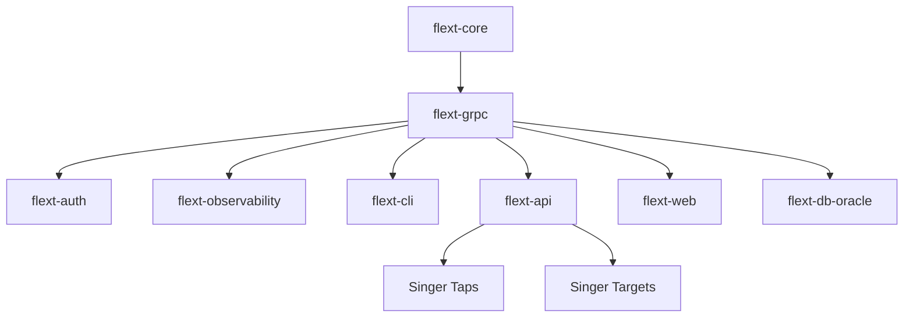

# flext-grpc FLEXT Ecosystem Integration
## Table of Contents

- [flext-grpc FLEXT Ecosystem Integration](#flext-grpc-flext-ecosystem-integration)
  - [Integration Overview](#integration-overview)
    - [FLEXT Ecosystem Position](#flext-ecosystem-position)
  - [Core Integration Patterns](#core-integration-patterns)
    - [flext-core Foundation](#flext-core-foundation)
    - [Dependency Injection Integration](#dependency-injection-integration)
  - [FLEXT Service Integration](#flext-service-integration)
    - [flext-auth Integration](#flext-auth-integration)
- [Planned integration (requires protobuf fix)](#planned-integration-requires-protobuf-fix)
    - [flext-observability Integration](#flext-observability-integration)
- [Planned integration](#planned-integration)
    - [flext-cli Integration](#flext-cli-integration)
- [Planned integration](#planned-integration)
  - [Data Integration Patterns](#data-integration-patterns)
    - [Service-to-Service Communication](#service-to-service-communication)
    - [Data Pipeline Integration](#data-pipeline-integration)
  - [Configuration Integration](#configuration-integration)
    - [Environment-Specific Configuration](#environment-specific-configuration)
    - [Service Discovery Integration](#service-discovery-integration)
- [Planned integration](#planned-integration)
  - [Testing Integration](#testing-integration)
    - [Test Framework Integration](#test-framework-integration)
    - [Mock Integration](#mock-integration)
  - [Production Integration](#production-integration)
    - [Deployment Patterns](#deployment-patterns)
    - [Monitoring Integration](#monitoring-integration)
- [Planned integration](#planned-integration)
  - [Migration and Upgrade Patterns](#migration-and-upgrade-patterns)
    - [Version Compatibility](#version-compatibility)
  - [Current Integration Status](#current-integration-status)
    - [Working Integrations](#working-integrations)
    - [Planned Integrations](#planned-integrations)
    - [Integration Priorities](#integration-priorities)


**Version**: 0.9.9 RC | **Updated**: September 17, 2025

Integration patterns and guidelines for flext-grpc within the FLEXT data integration ecosystem.

## Integration Overview

flext-grpc serves as the gRPC communication layer for FLEXT ecosystem services,
     providing inter-service communication.

### FLEXT Ecosystem Position



## Core Integration Patterns

### flext-core Foundation

flext-grpc components use flext-core patterns (see flext-core documentation for details):

```python
from flext_core import FlextBus
from flext_core import FlextConfig
from flext_core import FlextConstants
from flext_core import FlextContainer
from flext_core import FlextContext
from flext_core import FlextDecorators
from flext_core import FlextDispatcher
from flext_core import FlextExceptions
from flext_core import FlextHandlers
from flext_core import FlextLogger
from flext_core import FlextMixins
from flext_core import FlextModels
from flext_core import FlextProcessors
from flext_core import FlextProtocols
from flext_core import FlextRegistry
from flext_core import FlextResult
from flext_core import FlextRuntime
from flext_core import FlextService
from flext_core import FlextTypes
from flext_core import FlextUtilities
from flext_grpc import FlextGrpcServerService, FlextGrpcConfig

class GrpcServiceManager:
    """Service manager using gRPC with flext-core integration."""

    def start_grpc_services(self) -> FlextResult[FlextTypes.StringList]:
        container = FlextContainer.get_global()
        # Implementation uses flext-core patterns
        return FlextResult.ok(["service1", "service2"])
```

### Dependency Injection Integration

flext-grpc services can be registered with FlextContainer:

```python
from flext_core import FlextBus
from flext_core import FlextConfig
from flext_core import FlextConstants
from flext_core import FlextContainer
from flext_core import FlextContext
from flext_core import FlextDecorators
from flext_core import FlextDispatcher
from flext_core import FlextExceptions
from flext_core import FlextHandlers
from flext_core import FlextLogger
from flext_core import FlextMixins
from flext_core import FlextModels
from flext_core import FlextProcessors
from flext_core import FlextProtocols
from flext_core import FlextRegistry
from flext_core import FlextResult
from flext_core import FlextRuntime
from flext_core import FlextService
from flext_core import FlextTypes
from flext_core import FlextUtilities
from flext_grpc import FlextGrpcPlatform

container = FlextContainer.get_global()
platform = FlextGrpcPlatform()
container.register("grpc_platform", platform)
```

## FLEXT Service Integration

### flext-auth Integration

Authentication and authorization for gRPC services:

```python
# Planned integration (requires protobuf fix)
from flext_auth import FlextAuthService
from flext_grpc import FlextGrpcServer
from flext_grpc.interceptors import AuthInterceptor  # Future

class AuthenticatedGrpcService:
    """gRPC service with flext-auth integration."""

    def __init__(self):
        container = FlextContainer.get_global()
        self._auth_service = container.get("auth_service").unwrap()

    def create_authenticated_server(self) -> FlextResult[FlextGrpcServer]:
        """Create gRPC server with authentication interceptors."""

        auth_interceptor = AuthInterceptor(self._auth_service)

        return create_server(FlextGrpcConfig(
            host="localhost",
            port=50051,
            interceptors=[auth_interceptor]  # Future feature
        ))
```

### flext-observability Integration

Monitoring and metrics for gRPC services:

```python
# Planned integration
from flext_observability import MetricsCollector, HealthChecker
from flext_grpc import FlextGrpcPlatform

class ObservableGrpcService:
    """gRPC service with monitoring integration."""

    def __init__(self):
        container = FlextContainer.get_global()
        self._metrics = container.get("metrics_collector").unwrap()
        self._health = container.get("health_checker").unwrap()

    def create_monitored_server(self) -> FlextResult[FlextGrpcServer]:
        """Create gRPC server with monitoring."""

        return create_server(FlextGrpcConfig(
            host="localhost",
            port=50051,
            enable_health_checking=True,
            enable_metrics=True
        ))
```

### flext-cli Integration

Command-line management for gRPC services:

```python
# Planned integration
from flext_cli import FlextCliApp
from flext_grpc import FlextGrpcPlatform

def create_grpc_cli() -> FlextCliApp:
    """Create CLI app for gRPC management."""

    cli = FlextCliApp("grpc-manager")

    @cli.command("start")
    def start_server(host: str = "localhost", port: int = 50051):
        """Start gRPC server."""
        platform = FlextGrpcPlatform()
        config = FlextGrpcConfig(host=host, port=port)

        server_result = create_server(config)
        if server_result.success:
            server = server_result.unwrap()
            print(f"Server started: {server.host}:{server.port}")

    @cli.command("health")
    def check_health(address: str):
        """Check server health."""
        # Health check implementation
        pass

    return cli
```

## Data Integration Patterns

### Service-to-Service Communication

gRPC communication between FLEXT services:

```python
from flext_grpc import FlextGrpcClient, FlextGrpcConfig
from flext_core import FlextBus
from flext_core import FlextConfig
from flext_core import FlextConstants
from flext_core import FlextContainer
from flext_core import FlextContext
from flext_core import FlextDecorators
from flext_core import FlextDispatcher
from flext_core import FlextExceptions
from flext_core import FlextHandlers
from flext_core import FlextLogger
from flext_core import FlextMixins
from flext_core import FlextModels
from flext_core import FlextProcessors
from flext_core import FlextProtocols
from flext_core import FlextRegistry
from flext_core import FlextResult
from flext_core import FlextRuntime
from flext_core import FlextService
from flext_core import FlextTypes
from flext_core import FlextUtilities

class FlextServiceConnector:
    """Connector for inter-service gRPC communication."""

    def __init__(self, service_name: str, target_host: str, target_port: int):
        self.service_name = service_name
        self.config = FlextGrpcConfig(host=target_host, port=target_port)

    def call_service(self, method: str, data: dict) -> FlextResult[FlextTypes.Dict]:
        """Make gRPC call to another FLEXT service."""

        return (
            create_client(self.config)
            .flat_map(lambda client: self._connect_client(client))
            .flat_map(lambda client: self._make_call(client, method, data))
        )

    def _connect_client(self, client: FlextGrpcClient) -> FlextResult[FlextGrpcClient]:
        """Connect to target service."""
        return client.connect()

    def _make_call(self, client: FlextGrpcClient, method: str, data: dict) -> FlextResult[FlextTypes.Dict]:
        """Make the actual service call."""
        # gRPC call implementation
        return FlextResult.ok({"response": "data"})
```

### Data Pipeline Integration

gRPC in data processing pipelines:

```python
from flext_grpc import FlextGrpcStream
from flext_core import FlextBus
from flext_core import FlextConfig
from flext_core import FlextConstants
from flext_core import FlextContainer
from flext_core import FlextContext
from flext_core import FlextDecorators
from flext_core import FlextDispatcher
from flext_core import FlextExceptions
from flext_core import FlextHandlers
from flext_core import FlextLogger
from flext_core import FlextMixins
from flext_core import FlextModels
from flext_core import FlextProcessors
from flext_core import FlextProtocols
from flext_core import FlextRegistry
from flext_core import FlextResult
from flext_core import FlextRuntime
from flext_core import FlextService
from flext_core import FlextTypes
from flext_core import FlextUtilities

class DataStreamProcessor:
    """Process data streams using gRPC."""

    def process_data_stream(self, input_stream: FlextGrpcStream) -> FlextResult[list]:
        """Process streaming data from another service."""

        results = []

        return (
            self._validate_stream(input_stream)
            .flat_map(lambda _: self._process_stream_data(input_stream, results))
            .map(lambda _: results)
        )

    def _validate_stream(self, stream: FlextGrpcStream) -> FlextResult[None]:
        """Validate stream configuration."""
        if stream.stream_type != "server_streaming":
            return FlextResult.fail("Expected server streaming")
        return FlextResult.ok(None)

    def _process_stream_data(self, stream: FlextGrpcStream, results: list) -> FlextResult[None]:
        """Process incoming stream data."""
        # Stream processing logic
        return FlextResult.ok(None)
```

## Configuration Integration

### Environment-Specific Configuration

Integration with FLEXT configuration patterns:

```python
from flext_core import FlextBus
from flext_core import FlextConfig
from flext_core import FlextConstants
from flext_core import FlextContainer
from flext_core import FlextContext
from flext_core import FlextDecorators
from flext_core import FlextDispatcher
from flext_core import FlextExceptions
from flext_core import FlextHandlers
from flext_core import FlextLogger
from flext_core import FlextMixins
from flext_core import FlextModels
from flext_core import FlextProcessors
from flext_core import FlextProtocols
from flext_core import FlextRegistry
from flext_core import FlextResult
from flext_core import FlextRuntime
from flext_core import FlextService
from flext_core import FlextTypes
from flext_core import FlextUtilities
from flext_grpc import FlextGrpcConfig

class FlextGrpcEnvironmentConfig(FlextConfig):
    """Environment-specific gRPC configuration."""

    # Development settings
    dev_grpc_host: str = "localhost"
    dev_grpc_port: int = 50051
    dev_grpc_workers: int = 4

    # Production settings
    prod_grpc_host: str = "0.0.0.0"
    prod_grpc_port: int = 50051
    prod_grpc_workers: int = 50

    def create_grpc_config(self, environment: str) -> FlextGrpcConfig:
        """Create gRPC config for specific environment."""

        if environment == "development":
            return FlextGrpcConfig(
                host=self.dev_grpc_host,
                port=self.dev_grpc_port,
                max_workers=self.dev_grpc_workers
            )
        elif environment == "production":
            return FlextGrpcConfig(
                host=self.prod_grpc_host,
                port=self.prod_grpc_port,
                max_workers=self.prod_grpc_workers,
                use_tls=True
            )
        else:
            raise ValueError(f"Unknown environment: {environment}")
```

### Service Discovery Integration

Integration with FLEXT service discovery:

```python
# Planned integration
from flext_core import FlextBus
from flext_core import FlextConfig
from flext_core import FlextConstants
from flext_core import FlextContainer
from flext_core import FlextContext
from flext_core import FlextDecorators
from flext_core import FlextDispatcher
from flext_core import FlextExceptions
from flext_core import FlextHandlers
from flext_core import FlextLogger
from flext_core import FlextMixins
from flext_core import FlextModels
from flext_core import FlextProcessors
from flext_core import FlextProtocols
from flext_core import FlextRegistry
from flext_core import FlextResult
from flext_core import FlextRuntime
from flext_core import FlextService
from flext_core import FlextTypes
from flext_core import FlextUtilities
from flext_grpc import FlextGrpcClient

class FlextServiceDiscovery:
    """Service discovery for gRPC services."""

    def __init__(self):
        container = FlextContainer.get_global()
        self._registry = container.get("service_registry").unwrap()

    def discover_service(self, service_name: str) -> FlextResult[FlextGrpcClient]:
        """Discover and connect to a gRPC service."""

        return (
            self._lookup_service(service_name)
            .flat_map(lambda address: self._create_client(address))
            .flat_map(lambda client: self._connect_client(client))
        )

    def _lookup_service(self, service_name: str) -> FlextResult[tuple[str, int]]:
        """Look up service address in registry."""
        # Service registry lookup
        return FlextResult.ok(("localhost", 50051))
```

## Testing Integration

### Test Framework Integration

Integration with FLEXT testing patterns:

```python
import pytest
from flext_core import FlextBus
from flext_core import FlextConfig
from flext_core import FlextConstants
from flext_core import FlextContainer
from flext_core import FlextContext
from flext_core import FlextDecorators
from flext_core import FlextDispatcher
from flext_core import FlextExceptions
from flext_core import FlextHandlers
from flext_core import FlextLogger
from flext_core import FlextMixins
from flext_core import FlextModels
from flext_core import FlextProcessors
from flext_core import FlextProtocols
from flext_core import FlextRegistry
from flext_core import FlextResult
from flext_core import FlextRuntime
from flext_core import FlextService
from flext_core import FlextTypes
from flext_core import FlextUtilities
from flext_grpc import FlextGrpcConfig, create_server
from flext_tests import FlextTestCase

class TestGrpcIntegration(FlextTestCase):
    """Test gRPC integration with FLEXT patterns."""

    def test_server_creation_with_flext_patterns(self):
        """Test server creation using FlextResult pattern."""

        config = FlextGrpcConfig(host="localhost", port=0)  # object port
        server_result = create_server(config)

        # Railway-oriented testing
        assert server_result.success
        server = server_result.unwrap()
        assert server.host == "localhost"
        assert server.port > 0

    def test_error_handling_integration(self):
        """Test error handling with flext-core patterns."""

        # Invalid configuration
        config = FlextGrpcConfig(host="", port=-1)
        server_result = create_server(config)

        # Verify FlextResult error handling
        assert server_result.is_failure
        assert "Invalid configuration" in server_result.error
```

### Mock Integration

Testing with FLEXT mock patterns:

```python
from unittest.mock import Mock
from flext_grpc import FlextGrpcPlatform
from flext_tests import FlextMockFactory

class TestGrpcMockIntegration:
    """Test gRPC with FLEXT mock patterns."""

    def test_platform_with_mock_services(self):
        """Test platform with mocked dependencies."""

        # Create mock using FLEXT patterns
        mock_container = FlextMockFactory.create_mock_container()
        mock_server_service = Mock()

        mock_container.register("server_service", mock_server_service)

        platform = FlextGrpcPlatform()
        # Platform uses mocked dependencies
```

## Production Integration

### Deployment Patterns

Integration with FLEXT deployment infrastructure:

```python
from flext_grpc import FlextGrpcPlatform, FlextGrpcConfig
from flext_core import FlextBus
from flext_core import FlextConfig
from flext_core import FlextConstants
from flext_core import FlextContainer
from flext_core import FlextContext
from flext_core import FlextDecorators
from flext_core import FlextDispatcher
from flext_core import FlextExceptions
from flext_core import FlextHandlers
from flext_core import FlextLogger
from flext_core import FlextMixins
from flext_core import FlextModels
from flext_core import FlextProcessors
from flext_core import FlextProtocols
from flext_core import FlextRegistry
from flext_core import FlextResult
from flext_core import FlextRuntime
from flext_core import FlextService
from flext_core import FlextTypes
from flext_core import FlextUtilities

class FlextGrpcProductionService:
    """Production-ready gRPC service."""

    def __init__(self):
        self._container = FlextContainer.get_global()
        self.logger = FlextLogger(__name__)
        self._platform = FlextGrpcPlatform()

    def start_production_service(self) -> FlextResult[None]:
        """Start gRPC service with production configuration."""

        return (
            self._load_production_config()
            .flat_map(lambda config: self._create_production_server(config))
            .flat_map(lambda server: self._start_with_monitoring(server))
            .map(lambda _: None)
        )

    def _load_production_config(self) -> FlextResult[FlextGrpcConfig]:
        """Load production configuration."""
        return FlextResult.ok(FlextGrpcConfig(
            host="0.0.0.0",
            port=50051,
            max_workers=50,
            use_tls=True,
            enable_health_checking=True
        ))
```

### Monitoring Integration

Integration with FLEXT monitoring systems:

```python
# Planned integration
from flext_observability import MetricsCollector
from flext_grpc import FlextGrpcServer

class MonitoredGrpcService:
    """gRPC service with comprehensive monitoring."""

    def __init__(self):
        self._metrics = MetricsCollector("grpc_service")

    def start_monitored_server(self, server: FlextGrpcServer) -> FlextResult[None]:
        """Start server with monitoring."""

        # Register metrics
        self._metrics.register_counter("grpc_requests_total")
        self._metrics.register_histogram("grpc_request_duration")
        self._metrics.register_gauge("grpc_active_connections")

        return self._platform.start_server(server)
```

## Migration and Upgrade Patterns

### Version Compatibility

Maintaining compatibility during ecosystem upgrades:

```python
from flext_core import FlextBus
from flext_core import FlextConfig
from flext_core import FlextConstants
from flext_core import FlextContainer
from flext_core import FlextContext
from flext_core import FlextDecorators
from flext_core import FlextDispatcher
from flext_core import FlextExceptions
from flext_core import FlextHandlers
from flext_core import FlextLogger
from flext_core import FlextMixins
from flext_core import FlextModels
from flext_core import FlextProcessors
from flext_core import FlextProtocols
from flext_core import FlextRegistry
from flext_core import FlextResult
from flext_core import FlextRuntime
from flext_core import FlextService
from flext_core import FlextTypes
from flext_core import FlextUtilities
from flext_grpc import FlextGrpcConfig

class GrpcVersionManager:
    """Manage gRPC version compatibility."""

    def migrate_to_new_version(self) -> FlextResult[None]:
        """Migrate gRPC configuration to new version."""

        return (
            self._backup_current_config()
            .flat_map(lambda _: self._update_configuration())
            .flat_map(lambda _: self._validate_migration())
        )

    def _backup_current_config(self) -> FlextResult[None]:
        """Backup current configuration."""
        return FlextResult.ok(None)

    def _update_configuration(self) -> FlextResult[None]:
        """Update to new configuration format."""
        return FlextResult.ok(None)
```

## Current Integration Status

### Working Integrations

- **flext-core**: Complete integration with foundation patterns
- **Type Safety**: Full type annotation compatibility
- **Error Handling**: Complete FlextResult integration
- **Dependency Injection**: FlextContainer integration ready

### Planned Integrations

- **flext-auth**: Authentication interceptors (blocked by protobuf issue)
- **flext-observability**: Metrics and monitoring (infrastructure exists)
- **flext-cli**: Management commands (patterns defined)

### Integration Priorities

1. **Fix Protobuf Compatibility** - Enables all other integrations
2. **Health Checking** - Standard gRPC health monitoring
3. **Authentication** - Security integration with flext-auth
4. **Monitoring** - Observability integration
5. **CLI Management** - Operational tools integration

---

This integration guide provides comprehensive patterns for using flext-grpc within the FLEXT ecosystem once the protobuf compatibility issue is resolved.
