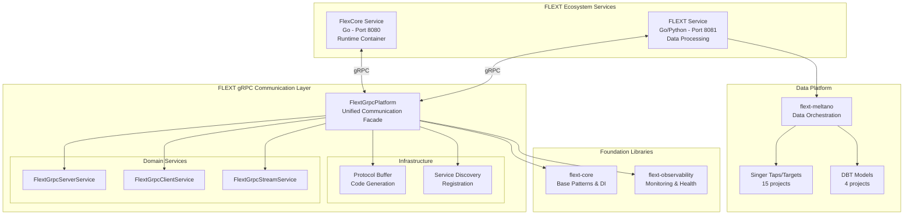

# FLEXT Ecosystem Integration Guide

Comprehensive guide for integrating FLEXT gRPC with the broader FLEXT ecosystem components and external systems.

## Overview

FLEXT gRPC serves as the **communication backbone** for the FLEXT distributed data integration platform, enabling seamless interaction between Go and Python services while maintaining type safety and reliability.

### Integration Architecture



## Core Service Integration

### FlexCore Integration (Go Service)

**Purpose**: Runtime container service providing plugin system and orchestration  
**Port**: 8080  
**Communication**: gRPC with shared Protocol Buffers

#### Integration Pattern

```python
from flext_grpc import FlextGrpcClient, FlextGrpcPlatform
from datetime import datetime, timezone

# Create client for FlexCore service
flexcore_client = FlextGrpcClient(
    id="flexcore-client",
    host="localhost",
    port=8080,
    created_at=datetime.now(timezone.utc)
)

# Platform integration
platform = FlextGrpcPlatform()
connect_result = platform.service.execute("connect", flexcore_client)

if connect_result.success:
    print("Connected to FlexCore service")
    # Perform operations through gRPC
else:
    print(f"FlexCore connection failed: {connect_result.error}")
```

#### Service Operations

**Plugin Management**:

```python
# Execute plugin through FlexCore (when Protocol Buffers implemented)
plugin_result = await client_service.call(
    flexcore_client,
    "PluginService",
    "ExecutePlugin",
    {
        "plugin_id": "meltano",
        "operation": "extract",
        "config": {...}
    }
)
```

**Health Monitoring**:

```python
# Health check integration
health_result = await client_service.call(
    flexcore_client,
    "HealthService",
    "CheckHealth",
    {}
)
```

### FLEXT Service Integration (Go/Python Bridge)

**Purpose**: Data processing service bridging Go runtime with Python data tools  
**Port**: 8081  
**Communication**: gRPC with Python-specific optimizations

#### Integration Pattern

```python
from flext_grpc import FlextGrpcClient

# Create client for FLEXT Service
flext_client = FlextGrpcClient(
    id="flext-service-client",
    host="localhost",
    port=8081,
    created_at=datetime.now(timezone.utc)
)

# Data pipeline operations
pipeline_result = await client_service.call(
    flext_client,
    "DataPipelineService",
    "ExecutePipeline",
    {
        "pipeline_id": "oracle-to-warehouse",
        "batch_size": 1000,
        "format": "singer"
    }
)
```

## Foundation Library Integration

### flext-core Foundation Patterns

**Purpose**: Base architectural patterns and dependency injection  
**Integration**: Direct dependency for all FLEXT gRPC operations

#### Dependency Injection Integration

```python
from flext_core import get_flext_container
from flext_grpc import FlextGrpcPlatform

# Global container integration
container = FlextContainer.get_global()
platform = FlextGrpcPlatform(container=container)

# Service registration
container.register("grpc_platform", platform)
container.register("grpc_server_service", FlextGrpcServerService())
```

#### FlextResult Pattern Integration

```python
from flext_core import FlextResult
from flext_grpc import FlextGrpcServer

def create_validated_server(config: dict) -> FlextResult[FlextGrpcServer]:
    """Create and validate gRPC server using FlextResult pattern."""
    try:
        server = FlextGrpcServer(**config)
        validation = server.validate_domain_rules()

        if validation.is_failure:
            return FlextResult[None].fail(f"Server validation failed: {validation.error}")

        return FlextResult[None].ok(server)
    except Exception as e:
        return FlextResult[None].fail(f"Server creation failed: {str(e)}")
```

#### Entity Pattern Integration

```python
from flext_core import FlextModels.Entity
from flext_grpc import FlextGrpcEntity

# All gRPC entities inherit from FlextModels.Entity foundation
class CustomGrpcEntity(FlextGrpcEntity):
    """Custom gRPC entity with flext-core foundation."""

    # Inherits immutable behavior, comparison, and validation patterns
    pass
```

### flext-observability Monitoring Integration

**Purpose**: Comprehensive monitoring, metrics, and health checks  
**Integration**: Performance monitoring and observability for gRPC operations

#### Health Check Integration

```python
from flext_observability import FlextHealthCheck
from flext_grpc import FlextGrpcPlatform

class GrpcHealthCheck(FlextHealthCheck):
    """Health check for gRPC platform operations."""

    def __init__(self, platform: FlextGrpcPlatform):
        self.platform = platform
        super().__init__(name="grpc_platform")

    async def check_health(self) -> FlextResult[dict]:
        """Check gRPC platform health."""
        # Implement health check logic
        return FlextResult[None].ok({"status": "healthy"})
```

#### Performance Monitoring

```python
from flext_observability import flext_monitor_function
from flext_grpc import FlextGrpcServerService

@flext_monitor_function("grpc_server_operation")
async def monitored_server_operation(server: FlextGrpcServer) -> FlextResult[FlextGrpcServer]:
    """Server operation with automatic monitoring."""
    service = FlextGrpcServerService()
    return service.execute("start", server)
```

#### Metrics Collection

```python
from flext_observability import FlextMetrics
from flext_grpc import FlextGrpcPlatform

# gRPC-specific metrics
grpc_metrics = FlextMetrics("grpc_platform")

# Track gRPC operation performance
@grpc_metrics.track_duration("grpc_call_duration")
@grpc_metrics.track_counter("grpc_calls_total")
async def tracked_grpc_call():
    """gRPC call with automatic metrics collection."""
    pass
```

## Data Platform Integration

### Singer Ecosystem Integration

**Components**: 15 Singer taps/targets + 4 DBT projects  
**Purpose**: Data extraction, transformation, and loading operations  
**Communication**: gRPC coordination for data pipeline orchestration

#### Pipeline Coordination

```python
from flext_grpc import FlextGrpcClient

async def coordinate_data_pipeline():
    """Coordinate Singer pipeline through gRPC."""

    # Connect to data orchestration service
    pipeline_client = FlextGrpcClient(
        id="pipeline-coordinator",
        host="localhost",
        port=8081,
        created_at=datetime.now(timezone.utc)
    )

    # Execute tap extraction
    extract_result = await client_service.call(
        pipeline_client,
        "SingerService",
        "ExecuteTap",
        {
            "tap_name": "tap-oracle-wms",
            "config": {...},
            "catalog": {...}
        }
    )

    # Execute target loading
    load_result = await client_service.call(
        pipeline_client,
        "SingerService",
        "ExecuteTarget",
        {
            "target_name": "target-postgres",
            "input_stream": extract_result.data
        }
    )
```

### Meltano Integration

**Purpose**: Data orchestration platform integration  
**Communication**: gRPC commands for Meltano operations

#### Meltano Operation Execution

```python
async def execute_meltano_operation():
    """Execute Meltano operation through gRPC."""

    meltano_result = await client_service.call(
        flext_client,
        "MeltanoService",
        "ExecuteCommand",
        {
            "command": "run",
            "arguments": ["tap-oracle", "target-postgres"],
            "environment": "production"
        }
    )

    return meltano_result
```

## Cross-Language Integration

### Protocol Buffer Shared Definitions

**Purpose**: Type-safe communication between Go and Python services  
**Status**: Planned implementation

#### Shared Proto Definitions

```protobuf
// flext_common.proto - Shared definitions
syntax = "proto3";

package flext.common;

// Common message types
message FlextResult {
    bool success = 1;
    string error = 2;
    google.protobuf.object data = 3;
}

message FlextModels.Entity {
    string id = 1;
    int64 created_at = 2;
    int64 updated_at = 3;
}

// gRPC service definitions
service FlextGrpcService {
    rpc CreateServer(CreateServerRequest) returns (FlextResult);
    rpc StartServer(StartServerRequest) returns (FlextResult);
    rpc StopServer(StopServerRequest) returns (FlextResult);
}
```

#### Code Generation Integration

```bash
# Generate Python code
make proto-gen

# Generated files structure
src/flext_grpc/generated/
├── flext_common_pb2.py
├── flext_common_pb2_grpc.py
├── flext_service_pb2.py
└── flext_service_pb2_grpc.py
```

### Type Safety Across Languages

**Python Type Validation**:

```python
from flext_grpc.generated import flext_common_pb2
from flext_grpc import FlextGrpcServer

def server_to_protobuf(server: FlextGrpcServer) -> flext_common_pb2.CreateServerRequest:
    """Convert Python entity to Protocol Buffer message."""
    return flext_common_pb2.CreateServerRequest(
        id=server.id,
        host=server.host,
        port=server.port,
        max_workers=server.max_workers
    )
```

**Go Integration** (FlexCore side):

```go
// Go service integration (FlexCore)
import "github.com/flext-sh/flext/proto/flext_common"

func HandleCreateServer(req *flext_common.CreateServerRequest) (*flext_common.FlextResult, error) {
    // Type-safe server creation in Go
    server := &GrpcServer{
        ID:         req.GetId(),
        Host:       req.GetHost(),
        Port:       req.GetPort(),
        MaxWorkers: req.GetMaxWorkers(),
    }

    return &flext_common.FlextResult{
        Success: true,
        Data:    server,
    }, nil
}
```

## Service Discovery Integration

### Dynamic Service Registration

**Purpose**: Automatic service discovery and registration  
**Status**: Planned implementation

#### Service Registration

```python
from flext_grpc import FlextGrpcPlatform

async def register_with_service_discovery():
    """Register gRPC services with discovery system."""

    platform = FlextGrpcPlatform()

    # Register server with discovery
    registration_result = await platform.register_service(
        service_name="flext-grpc-server",
        host="localhost",
        port=50051,
        health_check="/health",
        metadata={
            "version": "0.9.0",
            "capabilities": ["streaming", "ssl"],
            "ecosystem_role": "communication"
        }
    )

    return registration_result
```

#### Service Discovery

```python
async def discover_services():
    """Discover available services in ecosystem."""

    discovery_result = await platform.discover_services(
        service_type="grpc",
        environment="production"
    )

    if discovery_result.success:
        services = discovery_result.data
        for service in services:
            print(f"Found service: {service.name} at {service.host}:{service.port}")
```

## Configuration Integration

### Environment-Aware Configuration

**Development Configuration**:

```python
from flext_grpc import FlextGrpcConfig

dev_config = FlextGrpcConfig(
    host="localhost",
    port=50051,
    max_workers=4,
    timeout=10.0,
    dev_mode=True,
    log_level="debug"
)
```

**Production Configuration**:

```python
prod_config = FlextGrpcConfig(
    host="0.0.0.0",
    port=50051,
    max_workers=20,
    timeout=30.0,
    use_ssl=True,
    cert_file="/etc/ssl/certs/server.pem",
    key_file="/etc/ssl/private/server.key",
    log_level="info"
)
```

### Ecosystem Configuration Coordination

```python
from flext_core import get_flext_container

# Shared configuration across ecosystem
container = FlextContainer.get_global()
ecosystem_config = container.get("ecosystem_config").data

grpc_config = FlextGrpcConfig(
    host=ecosystem_config.grpc_host,
    port=ecosystem_config.grpc_port,
    timeout=ecosystem_config.default_timeout,
    use_ssl=ecosystem_config.security_enabled
)
```

## Current Status and Roadmap

### Integration Status

**Completed**:

- ✅ flext-core foundation integration
- ✅ flext-observability monitoring hooks
- ✅ Configuration management patterns
- ✅ FlextResult error handling integration

**In Progress**:

- 🚧 Protocol Buffer shared definitions
- 🚧 FlexCore/FLEXT Service communication
- 🚧 Service discovery implementation

**Planned**:

- ⏳ Singer ecosystem coordination
- ⏳ Meltano operation integration
- ⏳ Advanced monitoring and tracing
- ⏳ Security integration (TLS/mTLS)

### Next Steps

**Priority 1** (Immediate - 1-2 weeks):

1. Implement Protocol Buffer definitions for Go/Python interoperability
2. Create functional FlexCore integration examples
3. Establish FLEXT Service communication patterns

**Priority 2** (Short term - 1 month):

1. Implement service discovery integration
2. Add comprehensive monitoring integration
3. Create Singer ecosystem coordination patterns

**Priority 3** (Medium term - 2-3 months):

1. Advanced security features integration
2. Performance optimization and tuning
3. Load balancing and failover patterns

For detailed development status and implementation priorities, see [../TODO.md](../TODO.md).
