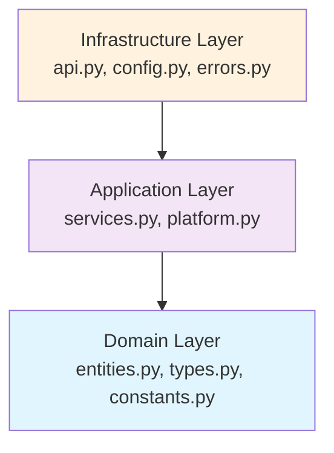

# Python Module Organization Standard - FLEXT gRPC

**Comprehensive guide to Python module organization for FLEXT gRPC communication platform**

**Version**: 0.9.0  
**Last Updated**: 2025-08-02  
**Authority**: FLEXT Development Team  
**Scope**: FLEXT gRPC Python modules

---

## 🎯 Overview

FLEXT gRPC implements **enterprise-grade Python module organization** following **Clean Architecture**, **Domain-Driven Design**, and **professional standards** aligned with the FLEXT ecosystem architecture and patterns.

### **Module Organization Philosophy**

1. **Clean Architecture Compliance** - Clear dependency direction and layer separation
2. **Domain-Driven Design** - Rich domain modeling with bounded contexts
3. **Enterprise Standards** - Professional naming, documentation, and structure
4. **FLEXT Ecosystem Integration** - Consistent patterns across 33 projects
5. **gRPC Communication Focus** - Specialized organization for gRPC operations

---

## 📁 Current Module Structure

### **FLEXT gRPC Package Structure**

```
src/
└── flext_grpc/                      # Main gRPC communication package
    ├── __init__.py                  # Public API exports and version
    ├── py.typed                     # Type information marker (optional)
    ├── entities.py                  # Domain entities (Server, Client, Channel, Service, Stream)
    ├── services.py                  # Domain services (business logic orchestration)
    ├── platform.py                 # Application service (unified facade)
    ├── api.py                       # Public API functions and utilities
    ├── config.py                    # Configuration management with Pydantic
    ├── types.py                     # Type definitions and validation functions
    ├── errors.py                    # Domain-specific error classes
    └── constants.py                 # Domain constants and enumerations
```

### **Supporting Structure**

```
flext-grpc/
├── src/flext_grpc/                  # Source package
├── tests/                           # Comprehensive test suite
│   ├── __init__.py
│   ├── conftest.py                  # Shared fixtures and configuration
│   ├── unit/                        # Unit tests (isolated component testing)
│   │   ├── __init__.py
│   │   ├── test_entities.py         # Domain entity testing
│   │   ├── test_services.py         # Domain service testing
│   │   ├── test_api.py              # Public API testing
│   │   ├── test_types.py            # Type validation testing
│   │   └── test_errors_complete.py  # Error handling testing
│   ├── integration/                 # Integration tests (component interaction)
│   │   ├── __init__.py
│   │   └── test_platform_integration.py # Platform integration testing
│   └── e2e/                         # End-to-end tests (complete workflows)
│       ├── __init__.py
│       ├── test_complete_grpc_workflow.py # Complete gRPC workflows
│       └── test_helpers.py          # E2E testing utilities
├── examples/                        # Practical usage examples
│   ├── README.md                    # Example documentation
│   ├── basic_usage.py               # Core functionality examples
│   ├── advanced_usage.py            # Complex scenarios and streaming
│   └── 03_error_handling_patterns.py # Error handling patterns
├── docs/                            # Comprehensive documentation
│   ├── README.md                    # Documentation hub
│   ├── TODO.md                      # Current gaps and priorities
│   ├── architecture/                # Architectural documentation
│   ├── integration/                 # FLEXT ecosystem integration
│   ├── standards/                   # This file and other standards
│   └── api/                         # API reference documentation
├── proto/                           # Protocol Buffer definitions (planned)
│   └── flext_grpc.proto             # gRPC service definitions
└── scripts/                         # Development and utility scripts
    ├── proto_gen.py                 # Protocol buffer generation
    └── quality_check.py             # Quality assurance scripts
```

---

## 🏗️ Architecture Patterns

### **Clean Architecture Implementation**

#### **Layer Organization**

```
📦 flext_grpc (Clean Architecture Layers)

🏢 Domain Layer (Inner Core)
├── entities.py                      # Rich domain entities with business logic
├── types.py                         # Domain type definitions
└── constants.py                     # Domain constants and enumerations

🎭 Application Layer (Use Cases)
├── services.py                      # Domain services (business orchestration)
└── platform.py                     # Application service (unified facade)

🔌 Interface Layer (External Communication)
├── api.py                           # Public API functions
├── config.py                        # Configuration interface
└── errors.py                        # Error interface definitions

📡 Infrastructure Layer (Framework/External)
└── (Future: Protocol buffer implementations, gRPC framework integration)
```

#### **Dependency Direction Rule**



### **Domain-Driven Design Patterns**

#### **Bounded Contexts**

1. **gRPC Server Management** (`FlextGrpcServer`, `FlextGrpcServerService`) - Server lifecycle and operations
2. **gRPC Client Management** (`FlextGrpcClient`, `FlextGrpcClientService`) - Client connectivity and communication
3. **gRPC Channel Management** (`FlextGrpcChannel`) - Connection state and channel operations
4. **gRPC Service Registry** (`FlextGrpcService`) - Service definition and method management
5. **gRPC Streaming** (`FlextGrpcStream`, `FlextGrpcStreamService`) - Streaming operations and flow control

#### **Entity Pattern Implementation**

```python
# Domain Entity Example - FlextGrpcServer
from flext_core import FlextEntity, FlextResult
from flext_grpc.types import TGrpcServerState

class FlextGrpcServer(FlextEntity):
    """
    gRPC server domain entity with rich behavioral methods.

    Implements complete server lifecycle management with state transitions,
    domain validation, and business rule enforcement following DDD patterns.
    """

    host: str = "localhost"
    port: int = 50051
    state: TGrpcServerState = "stopped"
    max_workers: int = 10

    def validate_domain_rules(self) -> FlextResult[None]:
        """Validate server domain business rules."""
        # Domain validation logic
        ...

    def start(self) -> FlextResult[FlextGrpcServer]:
        """Start server with state transition validation."""
        if self.state != "stopped":
            return FlextResult.fail(f"Cannot start from state: {self.state}")
        return self.copy_with(state="starting")
```

#### **Service Pattern Implementation**

```python
# Domain Service Example - FlextGrpcServerService
from flext_core import FlextDomainService, FlextResult

class FlextGrpcServerService(FlextDomainService):
    """
    Domain service for gRPC server business operations.

    Orchestrates server lifecycle operations, coordinates with platform
    services, and implements complex business workflows using Command pattern.
    """

    def execute(self, operation: str, *args: object) -> FlextResult[object]:
        """Execute server operation using Command pattern."""
        # Command pattern implementation with validation
        ...

    def start_server(self, server: FlextGrpcServer) -> FlextResult[FlextGrpcServer]:
        """Start server with comprehensive lifecycle management."""
        # Business logic orchestration
        ...
```

---

## 📋 Module Documentation Standards

### **Module-Level Docstrings**

#### **Complete Module Documentation Example**

```python
"""FLEXT gRPC Domain Entities - Core business entities for gRPC communication.

This module implements the domain layer entities for the FLEXT gRPC communication
platform following Clean Architecture and Domain-Driven Design principles. All entities
are immutable and include comprehensive domain validation.

Key Components:
    - FlextGrpcServer: Server lifecycle and state management
    - FlextGrpcClient: Client connection management with SSL support
    - FlextGrpcChannel: gRPC channel abstraction with connection states
    - FlextGrpcService: Service definition with method registration
    - FlextGrpcStream: Streaming operations for all gRPC stream types

Architecture:
    Domain entities form the core of the gRPC communication platform, implementing
    rich business behavior with immutable state transitions. Each entity includes
    domain validation and follows the FlextEntity pattern from flext-core.

Example:
    Basic server entity creation and validation:

    >>> from datetime import datetime, timezone
    >>> server = FlextGrpcServer(
    ...     id="main-server",
    ...     host="localhost",
    ...     port=50051,
    ...     max_workers=10,
    ...     created_at=datetime.now(timezone.utc)
    ... )
    >>> validation = server.validate_domain_rules()
    >>> print(validation.is_success)
    True

Integration:
    - Built on flext-core entity foundations for consistent patterns
    - Integrates with flext-observability for monitoring and health checks
    - Provides domain model for gRPC communication across FLEXT ecosystem

Author: FLEXT Development Team
Version: 0.9.0
License: MIT
Copyright (c) 2025 FLEXT Contributors
SPDX-License-Identifier: MIT
"""
```

### **Class-Level Docstrings**

#### **Comprehensive Class Documentation Example**

```python
class FlextGrpcServer(FlextGrpcEntity):
    """gRPC server entity implementing complete server lifecycle management.

    Domain entity representing a gRPC server with comprehensive state management,
    configuration validation, and service lifecycle operations. Provides rich
    behavioral methods for server operations following enterprise patterns.

    Attributes:
        host: Server bind address (IPv4, IPv6, or hostname)
        port: Server port number (1024-65535 range enforced)
        state: Current server state (stopped, starting, running, stopping)
        max_workers: Maximum number of worker threads for request processing
        services: List of registered gRPC service implementations

    State Machine:
        stopped -> starting -> running -> stopping -> stopped

    Domain Rules:
        - Host cannot be empty or whitespace-only
        - Port must be in valid range (1024-65535)
        - Max workers must be >= 1
        - State must be valid server state
        - Service registrations must be valid

    Integration:
        - Works with FlextGrpcServerService for business operations
        - Integrates with flext-observability for health monitoring
        - Supports FLEXT ecosystem service registration patterns

    Example:
        >>> from datetime import datetime, timezone
        >>> server = FlextGrpcServer(
        ...     id="production-server",
        ...     host="0.0.0.0",
        ...     port=50051,
        ...     max_workers=20,
        ...     created_at=datetime.now(timezone.utc)
        ... )
        >>> validation = server.validate_domain_rules()
        >>> print(validation.is_success)
        True
        >>> start_result = server.start()
        >>> print(start_result.data.state)
        'starting'
    """
```

### **Method-Level Docstrings**

#### **Complete Method Documentation Example**

```python
def validate_domain_rules(self) -> FlextResult[None]:
    """Validate server domain business rules.

    Ensures server configuration meets business requirements including
    host validation, port range checking, worker limits, and state consistency.
    All domain rules are enforced to maintain data integrity and business invariants.

    Returns:
        FlextResult[None]: Success with None data, or failure with detailed error message

    Domain Rules Validated:
        - Host cannot be empty or whitespace-only
        - Port must be in valid range (FLEXT_GRPC_MIN_PORT to FLEXT_GRPC_MAX_PORT)
        - Max workers must be >= 1 for processing capacity
        - Server state must be valid gRPC server state
        - All configuration values must be consistent

    Example:
        >>> server = FlextGrpcServer(
        ...     id="test-server",
        ...     host="",  # Invalid empty host
        ...     port=50051,
        ...     created_at=datetime.now(timezone.utc)
        ... )
        >>> result = server.validate_domain_rules()
        >>> print(result.is_failure)
        True
        >>> print(result.error)
        'Server host cannot be empty'

        >>> valid_server = FlextGrpcServer(
        ...     id="valid-server",
        ...     host="localhost",
        ...     port=50051,
        ...     max_workers=10,
        ...     created_at=datetime.now(timezone.utc)
        ... )
        >>> result = valid_server.validate_domain_rules()
        >>> print(result.is_success)
        True

    Integration:
        Used by FlextGrpcServerService before all operations to ensure
        business rule compliance. Integrates with platform validation
        workflows and error reporting systems.

    Performance:
        Validation is lightweight with O(1) complexity. Safe to call
        frequently during server operations without performance impact.
    """
```

### **Type Annotations Standards**

#### **Comprehensive Type Annotations**

```python
from typing import Dict, List, Optional, Protocol, Union, TypeVar, Generic, Literal
from pathlib import Path
from datetime import datetime
from flext_core import FlextResult, FlextEntity
from flext_grpc.types import TGrpcServerState, TGrpcHost, TGrpcPort

# Type variables for generic implementations
T = TypeVar('T')
ServerType = TypeVar('ServerType', bound='FlextGrpcServer')

# Protocol definitions for dependency injection
class GrpcServerProtocol(Protocol):
    """Protocol defining gRPC server interface for dependency injection."""

    def start(self) -> FlextResult[FlextGrpcServer]: ...
    def stop(self) -> FlextResult[FlextGrpcServer]: ...
    def validate_domain_rules(self) -> FlextResult[None]: ...

# Literal types for enhanced type safety
ServerOperation = Literal["start", "stop", "restart", "status"]
ServerConfigMode = Literal["development", "production", "testing"]

class FlextGrpcServerService(Generic[T]):
    """Generic server service with configurable server types."""

    def __init__(
        self,
        server_factory: Optional[Callable[..., T]] = None,
        config_mode: ServerConfigMode = "production",
        logger: Optional[FlextLogger] = None
    ) -> None:
        """Initialize server service with optional dependencies."""
        ...

    def execute_operation(
        self,
        operation: ServerOperation,
        server: Union[FlextGrpcServer, GrpcServerProtocol],
        options: Dict[str, Union[str, int, bool, None]] = None
    ) -> FlextResult[T]:
        """Execute server operation with type-safe configuration."""
        ...

    def create_server_from_config(
        self,
        config: Dict[str, Union[str, int]],
        validation_mode: Literal["strict", "permissive"] = "strict"
    ) -> FlextResult[FlextGrpcServer]:
        """Create server from configuration with validation mode."""
        ...
```

---

## 🔧 Import Organization

### **Import Standards (PEP8 + FLEXT Extensions)**

#### **Standard Import Order**

```python
"""Example module showing proper import organization for FLEXT gRPC."""

# 1. Standard library imports (alphabetical within section)
import os
import sys
from datetime import datetime, timezone
from pathlib import Path
from typing import (
    Any,
    Dict,
    List,
    Optional,
    Protocol,
    Union,
)

# 2. Third-party imports (alphabetical)
import grpc
import pydantic
from google.protobuf import message
from pydantic import Field, validator

# 3. FLEXT ecosystem imports (foundation first, then alphabetical)
from flext_core import (
    FlextEntity,
    FlextResult,
    FlextLogger,
    FlextContainer,
    get_flext_container,
    get_logger,
)
from flext_observability import (
    HealthChecker,
    MetricsCollector,
    monitor_function,
)

# 4. Local package imports (relative imports for same package)
from .constants import (
    FLEXT_GRPC_MAX_PORT,
    FLEXT_GRPC_MIN_PORT,
    FlextGrpcConstants,
)
from .types import (
    TGrpcChannelState,
    TGrpcServerState,
    TGrpcStreamType,
    TGrpcTarget,
)

# 5. Local module imports (absolute imports within project)
from flext_grpc.config import FlextGrpcConfig
from flext_grpc.entities import FlextGrpcServer, FlextGrpcClient
from flext_grpc.errors import (
    FlextGrpcError,
    FlextGrpcConfigurationError,
    FlextGrpcConnectionError,
)

# 6. TYPE_CHECKING imports (avoid circular imports)
from typing import TYPE_CHECKING

if TYPE_CHECKING:
    from flext_grpc.platform import FlextGrpcPlatform
    from flext_grpc.services import FlextGrpcServerService
```

### **Public API Exports (`__init__.py`)**

#### **Comprehensive Public API Definition**

```python
"""FLEXT gRPC - Enterprise gRPC Communication Platform.

Modern gRPC communication platform following Clean Architecture and DDD.
Built on Python 3.13 with unified client/server management and streaming capabilities.
"""

from __future__ import annotations

import importlib.metadata

# Import from flext-core for foundational patterns
from flext_core import FlextContainer, FlextResult

# Version management
try:
    __version__ = importlib.metadata.version("flext-grpc")
except importlib.metadata.PackageNotFoundError:
    __version__ = "0.9.0"

__version_info__ = tuple(int(x) for x in __version__.split(".") if x.isdigit())

# API functions
from flext_grpc.api import (
    create_channel,
    create_client,
    create_complete_setup,
    create_config,
    create_server,
    create_service,
    create_stream,
    parse_address,
    validate_address,
)

# Configuration
from flext_grpc.config import FlextGrpcConfig

# Domain entities
from flext_grpc.entities import (
    FlextGrpcChannel,
    FlextGrpcClient,
    FlextGrpcServer,
    FlextGrpcService,
    FlextGrpcStream,
)

# Errors
from flext_grpc.errors import (
    FlextGrpcConfigurationError,
    FlextGrpcConnectionError,
    FlextGrpcError,
    FlextGrpcTimeoutError,
    FlextGrpcValidationError,
)

# Platform
from flext_grpc.platform import FlextGrpcPlatform

# Domain Services
from flext_grpc.services import (
    FlextGrpcClientService,
    FlextGrpcServerService,
    FlextGrpcStreamService,
)

# Types
from flext_grpc.types import (
    TGrpcChannelState,
    TGrpcHost,
    TGrpcMethodName,
    TGrpcPort,
    TGrpcServerState,
    TGrpcServiceName,
    TGrpcStreamType,
    TGrpcTarget,
    TGrpcTimeout,
    flext_grpc_parse_target,
    flext_grpc_validate_target,
)

# Organized public API exports
__all__ = [
    # Core Foundation
    "FlextContainer",
    "FlextResult",

    # Domain Entities
    "FlextGrpcChannel",
    "FlextGrpcClient",
    "FlextGrpcServer",
    "FlextGrpcService",
    "FlextGrpcStream",

    # Domain Services
    "FlextGrpcClientService",
    "FlextGrpcServerService",
    "FlextGrpcStreamService",

    # Application Services
    "FlextGrpcPlatform",

    # Configuration
    "FlextGrpcConfig",

    # Error Classes
    "FlextGrpcError",
    "FlextGrpcConfigurationError",
    "FlextGrpcConnectionError",
    "FlextGrpcTimeoutError",
    "FlextGrpcValidationError",

    # Type Definitions
    "TGrpcChannelState",
    "TGrpcHost",
    "TGrpcMethodName",
    "TGrpcPort",
    "TGrpcServerState",
    "TGrpcServiceName",
    "TGrpcStreamType",
    "TGrpcTarget",
    "TGrpcTimeout",

    # API Functions
    "create_channel",
    "create_client",
    "create_complete_setup",
    "create_config",
    "create_server",
    "create_service",
    "create_stream",
    "parse_address",
    "validate_address",
    "flext_grpc_parse_target",
    "flext_grpc_validate_target",

    # Version Information
    "__version__",
    "__version_info__",
]

# Module metadata
__architecture__ = "Clean Architecture + DDD"
__author__ = "FLEXT Development Team"
__license__ = "MIT"
__email__ = "team@flext.sh"
__url__ = "https://github.com/flext-sh/flext/tree/main/flext-grpc"

# Module-level logger
from flext_core import get_logger
logger = get_logger(__name__)
logger.info("FLEXT gRPC initialized", version=__version__, architecture=__architecture__)
```

---

## 🧪 Testing Organization

### **Test Module Structure**

#### **Comprehensive Test Organization**

```
tests/
├── __init__.py                      # Test package initialization
├── conftest.py                      # Shared pytest configuration and fixtures
├── unit/                            # Unit tests (isolated components)
│   ├── __init__.py
│   ├── test_entities.py             # Domain entity testing
│   │   ├── TestFlextGrpcServer      # Server entity tests
│   │   ├── TestFlextGrpcClient      # Client entity tests
│   │   ├── TestFlextGrpcChannel     # Channel entity tests
│   │   ├── TestFlextGrpcService     # Service entity tests
│   │   └── TestFlextGrpcStream      # Stream entity tests
│   ├── test_services.py             # Domain service testing
│   │   ├── TestFlextGrpcServerService   # Server service tests
│   │   ├── TestFlextGrpcClientService   # Client service tests
│   │   └── TestFlextGrpcStreamService   # Stream service tests
│   ├── test_platform.py             # Platform service testing
│   ├── test_api.py                  # Public API function testing
│   ├── test_config.py               # Configuration management testing
│   ├── test_types.py                # Type validation testing
│   ├── test_errors.py               # Error handling testing
│   └── test_constants.py            # Constants validation testing
├── integration/                     # Integration tests (component interaction)
│   ├── __init__.py
│   ├── test_platform_integration.py # Platform integration testing
│   ├── test_flext_core_integration.py # flext-core integration
│   ├── test_observability_integration.py # Monitoring integration
│   └── test_ecosystem_integration.py # FLEXT ecosystem integration
├── e2e/                            # End-to-end tests (complete workflows)
│   ├── __init__.py
│   ├── test_complete_grpc_workflow.py # Complete gRPC workflows
│   ├── test_client_server_communication.py # Client-server E2E
│   ├── test_streaming_workflows.py  # Streaming operation E2E
│   └── test_helpers.py              # E2E testing utilities
├── performance/                     # Performance and load tests
│   ├── __init__.py
│   ├── test_server_performance.py   # Server performance benchmarks
│   ├── test_client_performance.py   # Client performance benchmarks
│   └── test_streaming_performance.py # Streaming performance tests
└── fixtures/                       # Test data and fixtures
    ├── __init__.py
    ├── sample_configs/              # Sample configuration files
    ├── mock_servers/                # Mock server implementations
    ├── test_data/                   # Test data for various scenarios
    └── proto_fixtures/              # Protocol buffer test data
```

#### **Test Documentation Standards**

```python
class TestFlextGrpcServer:
    """Comprehensive test suite for FlextGrpcServer domain entity.

    Tests server entity functionality including lifecycle management, state
    transitions, domain validation, and integration with service layer.
    Ensures compliance with Clean Architecture and DDD principles.

    Test Categories:
        - Entity creation and validation
        - State transition correctness
        - Domain rule enforcement
        - Error handling and edge cases
        - Integration with services
        - Performance characteristics

    Fixtures Used:
        - valid_server_config: Valid server configuration data
        - invalid_server_configs: Various invalid configurations for error testing
        - mock_flext_container: Mocked dependency injection container
        - clean_test_environment: Clean test environment setup

    Coverage Requirements:
        - 100% line coverage for all public methods
        - 95% branch coverage for domain validation logic
        - All error paths tested with specific assertions
        - Performance benchmarks for critical operations
    """

    @pytest.mark.unit
    def test_server_creation_with_valid_config(
        self,
        valid_server_config: Dict[str, Union[str, int]],
        clean_test_environment: None
    ) -> None:
        """Test successful server creation with valid configuration.

        Validates that server entity:
        1. Accepts valid configuration parameters
        2. Initializes with correct default values
        3. Passes domain rule validation
        4. Returns appropriate entity type

        Args:
            valid_server_config: Pytest fixture with valid server configuration
            clean_test_environment: Pytest fixture for clean test setup

        Expected Behavior:
            - Server entity created with provided configuration
            - All attributes properly initialized
            - Domain validation returns success
            - Entity comparison and hashing work correctly

        Test Pattern:
            Follows Arrange-Act-Assert (AAA) pattern with comprehensive
            verification of entity state and behavior.
        """
        # Arrange
        config = valid_server_config
        expected_host = config["host"]
        expected_port = config["port"]

        # Act
        server = FlextGrpcServer(**config)
        validation_result = server.validate_domain_rules()

        # Assert
        assert server.host == expected_host
        assert server.port == expected_port
        assert server.state == "stopped"  # Default initial state
        assert validation_result.is_success
        assert server.entity_type == "FlextGrpcServer"

        # Additional behavioral tests
        assert server.is_running() is False  # Initial state
        assert isinstance(server.created_at, datetime)
        assert server.id is not None and len(server.id) > 0

    @pytest.mark.unit
    @pytest.mark.parametrize("invalid_config,expected_error", [
        ({"host": "", "port": 50051}, "Server host cannot be empty"),
        ({"host": "localhost", "port": 80}, "Invalid port: 80"),
        ({"host": "localhost", "port": 65536}, "Invalid port: 65536"),
        ({"host": "localhost", "port": 50051, "max_workers": 0}, "Max workers must be >= 1"),
    ])
    def test_server_validation_with_invalid_configs(
        self,
        invalid_config: Dict[str, Union[str, int]],
        expected_error: str
    ) -> None:
        """Test domain validation with various invalid configurations.

        Ensures domain rules are properly enforced for all invalid
        configuration scenarios, with specific error messages that
        provide actionable feedback for correcting the issues.

        Args:
            invalid_config: Parametrized invalid configuration
            expected_error: Expected validation error message

        Expected Behavior:
            - Domain validation returns failure
            - Error message matches expected validation message
            - No exceptions thrown during validation
            - Entity state remains consistent
        """
        # Arrange & Act
        server = FlextGrpcServer(
            id="test-server",
            created_at=datetime.now(timezone.utc),
            **invalid_config
        )
        validation_result = server.validate_domain_rules()

        # Assert
        assert validation_result.is_failure
        assert expected_error in validation_result.error
        assert server.entity_type == "FlextGrpcServer"  # Entity still valid structurally
```

---

## 📊 Quality Standards

### **Code Quality Requirements**

#### **Documentation Coverage Standards**

- **100% coverage** for all public APIs and classes
- **95% coverage** for internal methods and functions
- **Comprehensive examples** for all public methods with working code
- **Architecture notes** explaining Clean Architecture positioning
- **Integration examples** showing FLEXT ecosystem usage
- **Performance notes** for operations with significant impact

#### **Type Annotation Coverage Standards**

- **100% coverage** for all function and method signatures
- **Generic types** where appropriate for reusability
- **Protocol definitions** for interfaces and dependency injection
- **Literal types** for enhanced type safety on constrained values
- **Union types** with enterprise patterns (avoid | syntax for compatibility)
- **Type aliases** for complex recurring type definitions

#### **Import Organization Standards**

- **PEP8 compliance** with FLEXT-specific extensions
- **Alphabetical ordering** within import groups
- **Explicit imports** (avoid `from module import *`)
- **Consistent aliasing** across all modules in package
- **TYPE_CHECKING imports** to avoid circular dependencies
- **Grouping by layer** (standard, third-party, flext, local)

### **Validation Tools and Automation**

#### **Quality Assurance Commands**

```bash
# Documentation validation
make docs-validate               # Validate all docstrings meet standards
make docs-coverage               # Check docstring coverage percentages
make docs-examples-test          # Test all documentation examples execute

# Type annotation validation
make type-check                  # MyPy strict mode validation (zero errors)
make type-coverage               # Type annotation coverage analysis
make type-safety-audit           # Comprehensive type safety audit

# Import organization validation
make import-check                # Validate import organization standards
make import-sort                 # Auto-sort imports according to standards
make import-lint                 # Lint import statements for best practices

# Code quality comprehensive
make quality-gate                # Complete quality gate validation
make lint-fix                    # Auto-fix linting issues where possible
make format-check                # Check code formatting compliance
```

#### **Pre-commit Integration**

```yaml
# .pre-commit-config.yaml - Quality enforcement
repos:
  - repo: local
    hooks:
      - id: flext-grpc-docstring-check
        name: FLEXT gRPC docstring validation
        entry: python -m flext_tools.quality.docstring_validator
        language: system
        files: ^src/flext_grpc/.*\.py$
        args: ["--standard=enterprise", "--examples-required"]

      - id: flext-grpc-type-check
        name: FLEXT gRPC type annotation validation
        entry: python -m mypy
        language: system
        files: ^src/flext_grpc/.*\.py$
        args: ["--strict", "--show-error-codes"]

      - id: flext-grpc-import-organization
        name: FLEXT gRPC import organization validation
        entry: python -m flext_tools.quality.import_organizer
        language: system
        files: ^src/flext_grpc/.*\.py$
        args: ["--check", "--standard=flext-grpc"]

      - id: flext-grpc-architecture-check
        name: FLEXT gRPC architecture compliance validation
        entry: python -m flext_tools.quality.architecture_validator
        language: system
        files: ^src/flext_grpc/.*\.py$
        args: ["--layers=domain,application,infrastructure"]
```

---

## 🔄 Module Evolution and Maintenance

### **Module Development Guidelines**

#### **Adding New Modules**

1. **Determine Architecture Layer** - Domain, Application, or Infrastructure
2. **Follow Naming Conventions** - snake_case, descriptive, layer-appropriate
3. **Create Comprehensive Docstrings** - Module, class, and method level
4. **Add Complete Type Annotations** - 100% coverage requirement
5. **Include Working Examples** - All public APIs with executable code
6. **Implement Domain Validation** - FlextResult pattern for error handling
7. **Add Comprehensive Tests** - Unit, integration, and performance tests
8. **Update Public API** - Add to `__init__.py` if public interface
9. **Document Integration** - How module fits in FLEXT ecosystem

#### **Refactoring Existing Modules**

1. **Maintain Backward Compatibility** - Deprecation warnings for breaking changes
2. **Preserve Public API Contracts** - Maintain existing function signatures
3. **Update Documentation** - Reflect all changes in docstrings and examples
4. **Migrate Tests** - Update test suite to cover new implementation
5. **Update Cross-References** - Fix all references in related modules
6. **Validate Architecture** - Ensure Clean Architecture compliance maintained
7. **Performance Impact Assessment** - Benchmark changes for performance regression

#### **Documentation Maintenance Schedule**

- **Weekly**: Review docstring accuracy for modified modules
- **Bi-weekly**: Validate all documentation examples still execute correctly
- **Monthly**: Architecture compliance review for new modules and changes
- **Quarterly**: Comprehensive standards compliance audit across all modules
- **Annually**: Complete documentation standards review and updates

### **Dependency Management Strategy**

#### **Internal Dependency Guidelines**

- **Minimize Circular Dependencies** - Use dependency injection and protocols
- **Clear Layer Dependencies** - Infrastructure → Application → Domain only
- **Document Dependencies** - All dependencies explained in module docstrings
- **Validate Dependency Graph** - Automated validation in CI/CD pipeline
- **Interface Segregation** - Use protocols for loose coupling between modules

#### **External Dependency Strategy**

- **Pin Specific Versions** - Ensure reproducible builds and compatibility
- **Document Dependency Rationale** - Why each dependency was chosen
- **Regular Security Audits** - Monthly dependency vulnerability scanning
- **Minimize Dependency Count** - Prefer standard library when appropriate
- **Compatible Version Ranges** - Allow patch updates while pinning major/minor

---

## 📞 Development Support and Guidelines

### **Module Development Checklist**

#### **Pre-Development Requirements**

- [ ] **Architecture Layer Determined** - Domain, Application, or Infrastructure
- [ ] **Module Purpose Documented** - Clear responsibility and scope definition
- [ ] **Integration Points Identified** - Dependencies and integration patterns
- [ ] **Public API Designed** - Interface contracts and usage patterns

#### **Development Standards Checklist**

- [ ] **Comprehensive Module Docstring** - Purpose, components, architecture, examples
- [ ] **Complete Class Documentation** - All classes with purpose, attributes, examples
- [ ] **Full Method Documentation** - Parameters, returns, examples, integration
- [ ] **100% Type Annotations** - All parameters, returns, attributes typed
- [ ] **Enterprise Error Handling** - FlextResult pattern for all fallible operations
- [ ] **Domain Validation** - validate_domain_rules() for all entities
- [ ] **Working Code Examples** - All examples tested and functional
- [ ] **Integration Documentation** - FLEXT ecosystem positioning and usage

#### **Testing Standards Checklist**

- [ ] **Unit Test Coverage** - 95%+ line and branch coverage
- [ ] **Integration Tests** - Component interaction validation
- [ ] **End-to-End Tests** - Complete workflow validation where applicable
- [ ] **Performance Tests** - Benchmarks for performance-critical operations
- [ ] **Error Path Testing** - All error conditions tested with specific assertions
- [ ] **Example Code Testing** - All documentation examples validated

#### **Quality Assurance Checklist**

- [ ] **Import Organization** - Follows PEP8 + FLEXT standards
- [ ] **Code Formatting** - Consistent with project formatting standards
- [ ] **Linting Compliance** - Zero linting errors with Ruff
- [ ] **Type Safety** - Zero MyPy errors in strict mode
- [ ] **Architecture Compliance** - Follows Clean Architecture principles
- [ ] **FLEXT Patterns** - Consistent with ecosystem patterns and standards

### **Code Review Requirements**

#### **Documentation Review Standards**

- [ ] **Docstring Completeness** - All required sections present and detailed
- [ ] **Example Functionality** - All examples execute without errors
- [ ] **Technical Accuracy** - All technical claims verified and accurate
- [ ] **Professional Language** - Clear, concise, professional English
- [ ] **Integration Clarity** - FLEXT ecosystem integration well documented

#### **Architecture Review Standards**

- [ ] **Layer Compliance** - Correct dependency direction and layer separation
- [ ] **DDD Principles** - Rich domain model and proper bounded contexts
- [ ] **Design Patterns** - Appropriate use of enterprise design patterns
- [ ] **FLEXT Integration** - Proper use of flext-core foundation patterns
- [ ] **Error Handling** - Consistent FlextResult usage throughout

#### **Performance and Security Review**

- [ ] **Performance Impact** - No significant performance regressions
- [ ] **Security Considerations** - No security vulnerabilities introduced
- [ ] **Resource Management** - Proper resource cleanup and lifecycle management
- [ ] **Error Security** - No sensitive information leaked in error messages

---

## 📚 Reference and Support

### **Documentation Resources**

#### **FLEXT Ecosystem Documentation**

- **[FLEXT Core Patterns](../../flext-core/CLAUDE.md)** - Foundation patterns and usage
- **[Clean Architecture Guide](../architecture/README.md)** - Architecture implementation details
- **[Integration Guide](../integration/README.md)** - FLEXT ecosystem integration patterns
- **[Development Guide](../CLAUDE.md)** - Complete development guidance for FLEXT gRPC

#### **External References**

- **[Clean Architecture](https://blog.cleancoder.com/uncle-bob/2012/08/13/the-clean-architecture.html)** - Original Clean Architecture principles
- **[Domain-Driven Design](https://martinfowler.com/bliki/DomainDrivenDesign.html)** - DDD concepts and patterns
- **[Python Type Hints](https://docs.python.org/3/library/typing.html)** - Python typing documentation
- **[gRPC Python](https://grpc.io/docs/languages/python/)** - gRPC Python implementation guide

### **Quality Assurance Resources**

#### **Automated Validation**

```bash
# Complete module validation workflow
make module-validate MODULE=entities    # Validate specific module
make module-quality-gate MODULE=all     # Complete quality gate for all modules
make module-documentation-check         # Documentation standards validation
make module-architecture-audit          # Architecture compliance validation
```

#### **Manual Review Guidelines**

- **Documentation Review**: Use checklist for comprehensive documentation review
- **Architecture Review**: Validate Clean Architecture and DDD compliance
- **Integration Review**: Ensure proper FLEXT ecosystem integration patterns
- **Performance Review**: Benchmark critical operations and validate performance

---

**Module Organization Standard Version**: 0.9.0  
**Last Updated**: 2025-08-02  
**Compliance**: FLEXT Ecosystem Standards  
**Maintained By**: FLEXT Development Team

This document serves as the **definitive guide** for Python module organization in FLEXT gRPC. All development, refactoring, and maintenance activities must follow these standards for ecosystem consistency and enterprise-grade quality.
